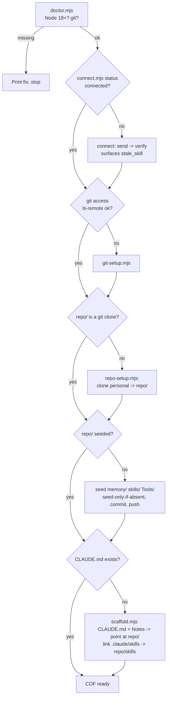

# feat: Guided setup + portable personal repo for the Chief of Staff

## Summary

Make first-run setup a single guided, re-runnable flow driven by `guild-connect`
choreography — a shared `doctor.mjs` preflight, then connect → git-setup → clone
the `personal` repo → scaffold the COF. Move the COF's durable layer (memory,
skills, Tools) into the cloned `personal` repo as portable files, and repoint the
COF config at `repo/`.

---

## Problem Frame

Two things break today (see origin: `docs/brainstorms/2026-06-22-cof-portable-repo-guided-setup-requirements.md`).

First-run install is fragile exactly where it hurts. The two observed failure
modes are plugin install/update (marketplace step fails, a stale version
installs, or an update doesn't pick up a release) and a missing toolchain (no
Node 18+ or no git on PATH), which surfaces as a cryptic script error instead of
a clear "install this first." A member who hits either before getting value
tends not to return.

The COF's accumulated value also isn't portable. Memory, the assistant's
self-built scripts, and any skills live in one project folder on one machine. The
member already gets a server-side `personal` repo on Forgejo and
`git-setup.mjs` already makes it clone/push without a prompt — but nothing puts
the COF's durable layer into it, so memory and capability can't follow the member
to a second machine or a second AI installation.

---

## Requirements

### Guided setup and the doctor

- R1. A preflight doctor runs before any setup step: checks Node ≥ 18 and git
  presence; on failure it prints a copy-pasteable fix and stops rather than
  letting a later step fail cryptically.
- R2. Connect-time key-migration breakage is surfaced through the existing
  `stale_skill` signal (emitted only by the `send` path). The doctor does not
  probe plugin freshness, and true version-drift detection is out of scope this
  release (see Open Questions).
- R3. `guild-connect` drives the full first-run sequence as one guided flow:
  doctor → connect → git-setup → clone `personal` repo → scaffold COF. No new
  top-level skill is introduced.
- R4. The doctor is a shared script (`doctor.mjs`) under
  `skills/guild-connect/scripts/`, callable as a first step by any skill.
- R5. The guided flow is idempotent and resumable: re-running is safe and
  resumes from the first incomplete step.
- R6. Every step emits a clear, actionable failure message, honoring
  `guild-connect`'s redaction rules — no tokens, headers, or raw error bodies.

### Portable personal repo

- R7. Setup clones the member's Forgejo `personal` repo into a `repo/` subfolder
  of the COF project.
- R8. The portable repo holds the durable personal layer: `memory/` (MEMORY.md
  index + one-fact-per-file), `skills/` (full agent skills), `Tools/` (informal
  instructions/scripts).
- R9. Memory uses the Anthropic-standard file convention (MEMORY.md index +
  one-fact-per-file with frontmatter), replacing the prior project-root format
  (`memory.md` + `context.txt` + `conversations/`) for new projects.
- R10. On first setup the repo is seeded and pushed; seeding is
  seed-only-if-absent — a re-run, or setup on a second machine against an
  already-populated repo, never overwrites existing content.
- R11. The COF reads and writes memory, skills, and Tools in `repo/` only;
  `CLAUDE.md` and `Notes/` remain local and outside the repo.
- R12. An informal `Tools/` instruction can be promoted into a packaged
  `skills/` skill; both are discoverable to the COF.

### COF config repointing

- R13. The COF `CLAUDE.md` file-sharing instructions point at `repo/memory/` —
  read first, write learnings there — not the old project-root `memory/`.
- R14. The COF is instructed to create new capability as project-scoped skills in
  `repo/skills/`, asking before creating, and to use skills already there.
- R15. The COF is instructed to look in `repo/Tools/` for informal instructions
  and to promote a Tool to a skill when worth packaging.

---

## Key Technical Decisions

- **Orchestrate via `guild-connect` choreography + a shared `doctor.mjs`, no new
  skill** (see origin Key Decisions). The guided flow is the model following an
  extended choreography in `guild-connect/SKILL.md` that calls the step scripts
  in order; the doctor is a reusable script, not a monolithic orchestrator.
- **Doctor checks local toolchain only; plugin version-drift is out of scope.**
  Pre-connect there is no credential and no server round-trip, so `doctor.mjs`
  verifies Node ≥ 18 and git locally and nothing else. The existing `stale_skill`
  signal detects only key-migration breakage and only on the `send`
  (first-connect) path — it is not a version check and never fires on a re-run —
  so it cannot stand in for version-drift detection. True freshness detection is
  deferred (see Open Questions); plugin install/update reliability is improved
  this release through clearer install/update docs (U7), not the doctor.
- **Each step script is independently idempotent; choreography only optimizes.**
  Correctness on a re-run does not depend on the model running the status checks
  in order: `repo-setup` is no-op-safe on an existing clone, `scaffold` is
  force-guarded, seeding is seed-only-if-absent. The choreography's cheap status
  checks (`connect.mjs status`, `git ls-remote`, a git-dir check on `repo/`,
  `CLAUDE.md` existence) let a re-run *skip* completed steps, but the scripts —
  not the prose — are what make re-running safe (R5). No progress file.
- **`repo-setup.mjs` owns clone + seeding; it never re-mints the git token.**
  Host + username come from `git-setup`'s own stdout (`{forgejoHost, username}`),
  threaded through the choreography (U5) — `repo-setup` does NOT call
  `/api/account/git-access`, because that route mints a fresh per-device token
  and re-minting would rotate and invalidate the credential `git-setup` just
  stored. On first run it clones `https://<host>/<username>/personal.git` into
  `repo/` (auth via the OS credential `git-setup` installed — never a printed
  token) and seeds the COF's own structure (an Anthropic-standard MEMORY.md stub,
  `skills/README.md`, `Tools/README.md`). On an existing clone it does NOT pull —
  the COF owns its own repo sync — it only ensures seeds are present
  (seed-only-if-absent) and pushes any unpushed commits. Commit + push only when
  there is something to push.
- **`scaffold.mjs` writes only the local COF wrapper.** It writes `CLAUDE.md` and
  `Notes/` pointing at `repo/`, and no longer creates a project-root `memory/`.
  The durable layer is owned by `repo-setup`. This retires the old
  `memory.md`/`context.txt`/`conversations/` format for new projects (R9).
- **`repo/skills/` discoverability via `.claude/skills` → `repo/skills`.** Spike
  confirmed (Windows, non-admin, on this repo): `fs.symlinkSync(absoluteTarget,
  link, 'junction')` creates an NTFS junction with no elevation and is
  transparently traversed (reads resolve `hello-skill/SKILL.md` through it).
  `'dir'`-type symlinks need Developer Mode/admin and are not safe to rely on. So
  `scaffold` uses `'junction'` on Windows and `'dir'` on POSIX, with an absolute
  target. The recursive-copy fallback is a last resort only (a point-in-time
  snapshot, not live). One residual: confirm Claude Code's skill *discovery*
  enumerates through the junction in a real session (see Open Questions).
- **The member's `personal` repo is trusted at filesystem level this release.**
  Skills and Tools loaded from `repo/` run with the same trust as any local
  project file; no per-skill approval gate, content-hash verification, or
  seed-push consent ceremony is added now. Repo-content hardening is deferred
  (see Scope Boundaries).
- **New scripts reuse the shared CLI contract.** `doctor.mjs` and
  `repo-setup.mjs` follow the `runCommand`/`actingAs` wrapper and the
  injected-deps + `node --test` pattern from
  `skills/guild-connect/scripts/git-setup.mjs`; redaction rules carry over (git
  token piped to git only, never logged; no raw API bodies) — and `repo-setup`
  scrubs git stderr (stripping any `https://<user>:<token>@host` URL-embedded
  credential) before surfacing a failure.

---

## High-Level Technical Design

The guided flow is a linear sequence of idempotent steps; each begins with a
status check that short-circuits when the step is already done, which is what
makes the whole flow re-runnable (R5).



### Output structure (new project)

```
<project>/
├── CLAUDE.md            # local COF config, points at repo/ — not version-controlled here
├── .claude/
│   └── skills/          # symlink/junction -> ../repo/skills (copy fallback)
├── repo/                # clone of the member's Forgejo `personal` repo (portable)
│   ├── memory/
│   │   └── MEMORY.md    # index + one-fact-per-file convention
│   ├── skills/
│   │   └── README.md
│   └── Tools/
│       └── README.md
└── Notes/
    └── chief-of-staff-guide.md
```

---

## Implementation Units

### U1. `doctor.mjs` — shared preflight script

- **Goal:** A reusable preflight that checks the local toolchain and stops with
  actionable guidance before any setup step runs.
- **Requirements:** R1, R4, R6.
- **Dependencies:** none.
- **Files:** `skills/guild-connect/scripts/doctor.mjs`,
  `skills/guild-connect/tests/doctor.test.mjs`.
- **Approach:** Pure helpers — `parseNodeVersion(str)` → major int, and a
  `checkEnv({ nodeVersion, gitExists })` that returns a structured result
  `{ ok, checks: [{ name, ok, fix }] }`. CLI wiring spawns `node --version` and
  `git --version` (reuse the `realRunGit`-style spawn from `git-setup.mjs`) and
  prints the JSON result via `runCommand`. Node-version source: `process.version`
  for the running interpreter. Plugin-freshness is not probed and no freshness
  field is reserved — version-drift detection is out of scope (KTD; Open
  Questions). `doctor.mjs` targets a Node syntax baseline old enough to start and
  print its own "upgrade Node" message rather than crashing, so a too-old Node
  still gets a friendly error instead of a parse failure.
- **Patterns to follow:** `chooseHelper`/`parseForgejoHost` pure-helper style and
  the deps-injected orchestrator in
  `skills/guild-connect/scripts/git-setup.mjs`; `runCommand` from `api.mjs`.
- **Test scenarios:**
  - `parseNodeVersion` returns 18 for `"v18.19.0"`, 20 for `"v20.0.0"`, and null
    for malformed input.
  - `checkEnv` with Node 18 + git present → `{ ok: true }`, all checks ok.
  - `checkEnv` with Node 16 → `ok: false`, the Node check carries an install fix
    string; git check still evaluated.
  - `checkEnv` with git absent → `ok: false`, git check carries a fix string.
  - Result object is JSON-serializable and contains no token/secret fields.
- **Verification:** Running `node doctor.mjs` on a machine with Node ≥ 18 + git
  prints `{ ok: true }`; on a deficient machine it prints the failing checks with
  fixes and exits non-zero.

### U2. `repo-setup.mjs` — clone the personal repo and seed it

- **Goal:** Clone `personal` into `repo/` and seed the COF's durable layer
  without ever clobbering existing content.
- **Requirements:** R7, R8, R9 (seeds), R10, R6.
- **Dependencies:** U1 (doctor precedes it in the flow); relies on `git-setup`
  having installed the OS credential AND passed its `{forgejoHost, username}`
  stdout through the choreography (U5).
- **Files:** `skills/guild-connect/scripts/repo-setup.mjs`,
  `skills/guild-connect/assets/repo-seeds/` (MEMORY.md stub, `skills/README.md`,
  `Tools/README.md`), `skills/guild-connect/tests/repo-setup.test.mjs`.
- **Approach:** Pure helpers — `personalCloneUrl({ host, username })` →
  `https://<host>/<username>/personal.git`, and `seedPlan(existingPaths)` →
  the subset of seed files to write (seed-only-if-absent). Host + username are
  passed IN (from `git-setup`'s stdout, threaded by the choreography), not
  fetched — `repo-setup` never calls `/api/account/git-access`, which would
  re-mint and invalidate the stored git token. Orchestrator (deps injected): when
  `repo/` is absent, `git clone` into it; when present, do NOT pull (the COF owns
  its sync). Compute the seed plan against the working tree and write missing
  seeds. On the first seed of an empty remote, detect the unborn branch, create
  the initial branch explicitly, and `git push -u origin <branch>`; otherwise
  push any unpushed commits. `GIT_TERMINAL_PROMPT=0` so a missing credential
  fails fast, and git stderr is scrubbed (strip `https://<user>:<token>@host`
  URL-embedded credentials) before any failure is surfaced. Seeds are the COF's
  own structure (Anthropic-standard MEMORY.md stub + `skills/`/`Tools/` READMEs),
  not an assistant-neutral format. Never print the token or raw API bodies.
- **Patterns to follow:** `git-setup.mjs` spawn wrapper and
  `actingAs()`/`runCommand` flow; `scaffold.mjs` seed-only-if-absent loop.
- **Test scenarios:**
  - `personalCloneUrl` builds the expected URL from host + username; tolerates a
    host passed as a full URL (reuse `parseForgejoHost`).
  - `seedPlan` with an empty repo returns all seed files; with `memory/MEMORY.md`
    present omits it but still returns the missing READMEs; against a populated
    repo returns an empty list.
  - Empty-remote first run: clone of a branchless remote → create the initial
    branch, seed, `push -u origin <branch>` exactly once.
  - Existing clone: orchestrator performs no `pull`; with seeds present and no
    unpushed commits it makes no commit and no push.
  - Existing clone with an unpushed local seed commit (simulated failed push):
    re-run pushes the existing commit and re-seeds nothing.
  - Run-twice idempotency: a second orchestrator run against the same tree
    produces zero new commits and zero file writes.
  - Failure path: clone non-zero → a body-free actionable error; git stderr
    carrying a `user:token@host` URL is scrubbed; no token appears in any output.
- **Verification:** First run against an empty `personal` clones, seeds, and
  pushes; a second run leaves the existing clone untouched (no pull) and makes no
  commit; running setup twice end-to-end produces no changes on the second pass.

### U3. `scaffold.mjs` — new `repo/` layout and skills linking

- **Goal:** Scaffold only the local COF wrapper (CLAUDE.md + Notes) pointing at
  `repo/`, and wire `.claude/skills` to `repo/skills`.
- **Requirements:** R9 (retire old memory), R11, R12 (linking), R13.
- **Dependencies:** U2 (repo/ exists before linking/pointing), U4 (template
  content); the `repo/skills` load-mechanism spike (Open Questions) resolves
  before this lands.
- **Files:** `skills/claudecof-setup/scripts/scaffold.mjs`,
  `skills/claudecof-setup/tests/scaffold.test.mjs` (new).
- **Approach:** Drop the project-root `memory/` tree and its `memory.md` /
  `context.txt` / `conversations/` seeding. Keep `CLAUDE.md` (force-guarded as
  today) and `Notes/chief-of-staff-guide.md`. Add a `linkSkills(target)` helper
  that creates `.claude/skills` via `fs.symlinkSync(absoluteRepoSkills, link,
  type)` where `type` is `'junction'` on Windows (`process.platform === "win32"`)
  and `'dir'` elsewhere — the spike confirmed `'junction'` needs no elevation — and
  is a no-op when `repo/skills` is absent. On `EPERM`/`EEXIST` fall back to a
  recursive copy (a documented stale snapshot, not the default path). Keep the
  `{ ok, created, skipped }` result shape.
- **Patterns to follow:** existing `scaffold.mjs` `fill`/`exists`/seed loop and
  JSON-to-stdout contract.
- **Test scenarios:**
  - Scaffolding a fresh target writes `CLAUDE.md` + `Notes/` and creates no
    project-root `memory/`.
  - `CLAUDE.md` already present without `force` → `{ ok: false, status: "exists" }`
    (unchanged behavior).
  - `linkSkills` with `repo/skills` present creates `.claude/skills` resolving to
    it; with `repo/skills` absent it is a no-op.
  - `linkSkills` copy-fallback path produces a `.claude/skills` directory whose
    contents match `repo/skills` when symlink creation throws.
  - Result JSON lists created vs skipped paths with forward-slash separators.
- **Verification:** A scaffolded project opens in Claude Code with skills from
  `repo/skills` discoverable and no stale project-root `memory/`.

### U4. COF config templates — repoint memory, skills, and Tools

- **Goal:** Update the COF's config and guide so it reads/writes the `repo/`
  layer and creates/promotes capability there.
- **Requirements:** R11, R12, R13, R14, R15.
- **Dependencies:** none (content), but pairs with U3.
- **Files:** `skills/claudecof-setup/assets/claude-md-template.md`,
  `skills/claudecof-setup/assets/chief-of-staff-guide.md`.
- **Approach:** In `claude-md-template.md`: Memory section → search/update
  `repo/memory/` (MEMORY.md index + one-fact-per-file), drop `context.txt` and
  `conversations/` references; Tools section → `repo/Tools/` for informal
  instructions (discoverable via CLAUDE.md instruction, since `Tools/` is not
  under `.claude/skills`); add skill guidance — create new project-scoped skills
  in `repo/skills/` only after asking, use skills already there, and promote a
  durable `Tools/` instruction into a packaged skill when worth it; update the
  Project Structure block to the new tree. Update `chief-of-staff-guide.md`
  first-tasks/troubleshooting to match (clone in `repo/`, memory in
  `repo/memory/`, skills/Tools graduation).
- **Patterns to follow:** existing template voice (scannable, imperative,
  `{{PLACEHOLDER}}` tokens preserved).
- **Test scenarios:** `Test expectation: none — documentation/templates, no
  behavioral change. Covered indirectly by U3 scaffold tests asserting the
  rendered file points at `repo/`.`
- **Verification:** A scaffolded `CLAUDE.md` references `repo/memory`,
  `repo/skills`, `repo/Tools` and contains the ask-before-creating-skill and
  promotion guidance; no references to the retired memory format remain.

### U5. `guild-connect` choreography — sequence the guided flow

- **Goal:** Extend `guild-connect`'s SKILL choreography to drive the full guided,
  resumable sequence.
- **Requirements:** R3, R5, R2, R6.
- **Dependencies:** U1, U2 (the scripts it sequences).
- **Files:** `skills/guild-connect/SKILL.md`.
- **Approach:** Add a preflight step (a shell-level `node --version` check, then
  run `doctor.mjs`; stop on failure) ahead of the connect choreography — a
  missing/too-old Node prevents `doctor.mjs` from starting, so the prerequisite
  note precedes invoking it. After profile/avatar, add the machine-setup
  sequence: `git-setup` → `repo-setup` → recommend/invoke `claudecof-setup`,
  threading `git-setup`'s `{forgejoHost, username}` stdout into `repo-setup`.
  Document the re-derived per-step status checks so a re-run resumes (R5), and
  that each script is independently safe to re-run. Document that `stale_skill`
  (emitted only by `send`, on key-migration) is surfaced at connect as
  key-migration breakage — not a version check and not a doctor responsibility
  (R2). Keep the existing hard rules (redaction, Acting as banner, one connect
  per environment).
- **Patterns to follow:** existing `## Choreography` numbered structure and hard
  rules in `skills/guild-connect/SKILL.md`.
- **Test scenarios:** `Test expectation: none — SKILL.md is model-facing
  choreography, not executable code.`
- **Verification:** Following the choreography on a clean machine reaches a
  working COF; re-running skips already-completed steps with no errors.

### U6. `claudecof-setup` SKILL — new layout and repo-setup integration

- **Goal:** Update the setup skill's workflow to the `repo/` layout and the
  doctor/repo-setup steps.
- **Requirements:** R7, R9, R11, R13–R15 (workflow guidance).
- **Dependencies:** U2, U3, U4.
- **Files:** `skills/claudecof-setup/SKILL.md`.
- **Approach:** Update "What it creates" to the new tree; reflect that the
  durable layer comes from `repo-setup` (clone of `personal`) and scaffold writes
  only CLAUDE.md + Notes pointing at `repo/`; note the doctor preflight; keep the
  guild-data prefill steps and the never-overwrite-CLAUDE.md hard rule.
- **Patterns to follow:** existing `claudecof-setup/SKILL.md` section structure.
- **Test scenarios:** `Test expectation: none — model-facing skill doc.`
- **Verification:** The skill doc's tree and workflow match the scaffold/repo-setup
  behavior; no references to the retired project-root `memory/` remain.

### U7. Reliability docs and test-reset updates

- **Goal:** Harden install/update guidance and make the reset/test harness aware
  of the new `repo/` layout and `.claude/skills` link.
- **Requirements:** R1/R3 (docs surface the doctor + guided flow); supports the
  plugin install/update failure mode from the brainstorm.
- **Dependencies:** U1–U3.
- **Files:** `README.md`, `skills/guild-connect/README.md` (if install steps
  live there), `test/reset-win.ps1`, `test/reset-mac.sh`.
- **Approach:** README: add the Node/git prerequisite up front (including that a
  too-old Node prevents the preflight from running), and clarify marketplace-update
  vs plugin-update commands. Reset scripts: both `reset-win.ps1` and `reset-mac.sh`
  already exist with parity — extend both (additive). Add removal of the scaffolded
  `repo/` clone and the `.claude/skills` link, deleting the junction/symlink itself
  BEFORE any recursive delete so teardown never follows the link into
  `repo/skills`; keep the existing credential/plugin cleanup.
- **Patterns to follow:** existing `test/reset-win.ps1` step structure and
  `Remove-DirSafe` helpers; mirror the same additions in `reset-mac.sh`.
- **Test scenarios:** `Test expectation: none — docs + test tooling. Validate by
  running reset --dry-run and confirming the new paths are listed.`
- **Verification:** `reset-win.ps1 -DryRun` lists the `repo/` clone and
  `.claude/skills` for removal; README install/update steps are accurate.

---

## Scope Boundaries

### Deferred for later (from origin)

- The broader COF config rework — commands/practices for reading email,
  prioritizing communications, and meeting prep. This plan only repoints the
  COF's file-sharing instructions (U4).
- Extracting facts from file memory into Hindsight.
- Migrating existing old-layout COF projects to the `repo/` structure (this plan
  targets new projects).

### Outside this phase's identity

- Replacing or retiring Hindsight portable memory. It stays installed and its
  capture hooks keep running; the COF simply does not depend on it.
- Repo-content security hardening — treating the member's `personal` repo as
  untrusted (per-skill approval gates, content-hash verification on load,
  seed-push consent and branch isolation). This release assumes the `personal`
  repo is trusted at the same level as the member's local filesystem (KTD), so
  skills and Tools load and run without an added trust gate. The git *token*
  redaction (scrubbing credentials from git stderr) is in scope — that is
  credential hygiene, independent of repo-content trust.

### Deferred to follow-up work

- Auto-graduation tooling for promoting a `Tools/` instruction into a packaged
  `skills/` skill (the COF does it by hand per U4 guidance for now).

---

## Open Questions

- **`repo/skills/` load mechanism — spike done; one residual.** Filesystem
  mechanism resolved: `fs.symlinkSync(absoluteTarget, link, 'junction')` on
  Windows (no elevation, transparently traversed) / `'dir'` on POSIX; copy
  fallback only on `EPERM`/`EEXIST`. Residual to confirm before U3/U4/U6 ship: a
  fresh Claude Code session pointed at a scaffolded project actually *discovers*
  skills under the junctioned `.claude/skills` — the filesystem traversal works;
  the discovery enumeration is the unverified half. If discovery does not follow
  the link, R14's live "use skills already there" needs different wiring. Plus:
  does CC re-scan mid-session so a COF-created skill is usable without a restart?
- **Plugin version-drift detection (deferred).** `stale_skill` detects only
  key-migration breakage on the `send` path — not a version check, and never on a
  re-run — so it cannot catch the brainstorm's "stale version / update didn't
  land" failure mode. A real check needs an unauthenticated version/manifest
  endpoint; absent that, version-drift is out of scope this release and the
  doctor does not attempt it. Install/update reliability is addressed via docs
  (U7).

---

## Risks & Dependencies

- **Load mechanism unverified.** R12/R14 discoverability depends on Claude Code
  honoring the `.claude/skills` link; the copy fallback is only a snapshot.
  Mitigation: the gating spike (Open Questions) resolves the mechanism before
  U3/U4/U6 land — this is the single largest risk in the plan.
- **Empty-repo first push.** Seeding then pushing to a brand-new `personal` repo
  must handle a bare/empty remote (no default branch). Mitigation: `repo-setup`
  detects the unborn branch, creates the initial branch, and `push -u` on first
  seed; covered by the U2 empty-remote test.
- **Ordering dependency on git access.** `repo-setup` assumes `git-setup` already
  installed a working OS credential AND passed it its `{forgejoHost, username}`
  stdout; the choreography enforces order and threading. The clone fails fast
  (`GIT_TERMINAL_PROMPT=0`) with a stderr-scrubbed, actionable message if not.
- **Redaction discipline.** New git-shelling scripts must never print tokens or
  raw API bodies; carried by reusing the `git-setup.mjs`/`api.mjs` patterns and
  asserted in tests.

---

## Sources / Research

- `skills/guild-connect/scripts/git-setup.mjs` — clone/credential pattern,
  deps-injected orchestrator, `GIT_TERMINAL_PROMPT=0`, `personal` repo URL shape.
- `skills/guild-connect/scripts/api.mjs` — `runCommand`/`actingAs`/`postJson`
  wrapper and redaction contract the new scripts reuse.
- `skills/guild-connect/scripts/config.mjs` — embedded version constants and the
  "outdated skill" surface behind `stale_skill`.
- `skills/claudecof-setup/scripts/scaffold.mjs` — seed-only-if-absent loop and
  JSON-result contract the new layout builds on.
- `test/reset-win.ps1` — existing cleanup steps to extend for `repo/` +
  `.claude/skills`.
