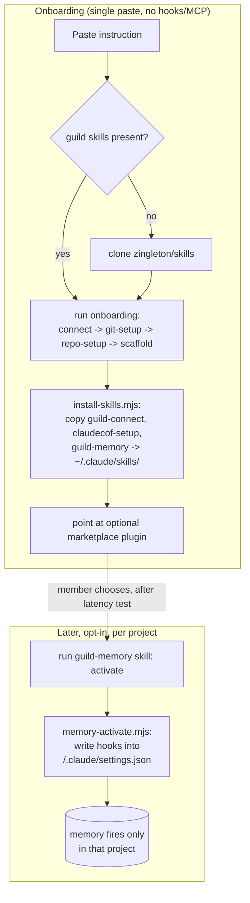

# feat: User-scope onboarding install + extracted Hindsight memory skill

## Summary

Make onboarding a single paste-able instruction that installs the guild skills
at **user scope** (`~/.claude/skills/`) and runs connect → git-setup →
repo-setup → scaffold — no marketplace, no `claude plugin install`. Extract the
Hindsight memory **hooks** out of the auto-loading plugin into a separate
`guild-memory` skill the member runs **later** to activate memory for one
project (default: the COF project). Onboarding itself ships no hooks. (Exposing
memory as an MCP server is out of scope — see Key Decisions.)

---

## Problem Frame

Users consistently fail to install the plugin because plugin install is a
host/CLI step they (or an in-session agent) try to run from inside a session,
where it can't take (see origin:
`docs/brainstorms/2026-06-22-reliable-onboarding-paste-requirements.md`). The
brainstorm decoupled onboarding from the marketplace. This plan simplifies the
distribution further on the member's direction: installing skills at user scope
removes the project `.claude/skills` junction conflict and the workspace-trust
prompt, and makes updates a re-run rather than a marketplace operation.

The second move is separation of concerns. The plugin currently auto-fires the
Hindsight memory hooks in every session that loads it (`.claude-plugin/plugin.json`
declares `UserPromptSubmit`/`Stop` → `memory-hook.mjs`). Memory should be opt-in,
confined to the project that wants it, and held until its latency is tested.
Pulling memory into its own skill makes onboarding lighter and memory explicit.

---

## Key Technical Decisions

- **Supersedes two origin decisions.** Origin R5/R7 (project-scope skills-dir
  plugin, workspace-trust) and R8 (hooks distributed-but-dormant) are replaced:
  guild skills install at **user scope** (no per-project plugin, no trust
  prompt), and the memory hooks are **not distributed by onboarding at all** —
  they live in the `guild-memory` skill and are written into a project only when
  the member activates them.
- **User-scope install via a copy script.** A new `install-skills.mjs` copies the
  guild skill folders into `~/.claude/skills/`. The paste-able instruction clones
  the repo (if the skills aren't already present), runs the onboarding from the
  clone, then runs the installer so the skills are available in every future
  session. Re-running it is the update path — no marketplace needed.
- **`guild-memory` is a sibling skill that reuses guild-connect's plumbing.** The
  memory scripts move into `skills/guild-memory/scripts/` and import the two
  shared modules they actually use — `credentials.mjs` and `api.mjs` — from
  guild-connect via the sibling path (`../../guild-connect/scripts/`), matching
  the shared-plumbing model in CLAUDE.md. (No memory script imports
  guild-connect's `config.mjs`; intra-memory imports like `./memory-mcp.mjs` stay
  relative and move together.) Onboarding installs both as siblings under
  `~/.claude/skills/`, so the path resolves.
- **Per-project memory activation writes only hooks, with a quoted user-scope
  path.** `memory-activate.mjs` writes the `UserPromptSubmit`/`Stop` hooks into
  the **target project's** `.claude/settings.json` (merge without clobbering),
  using a **quoted absolute path** to the user-scope-installed `memory-hook.mjs`
  (resolved against `~/.claude/skills/guild-memory/scripts/`, honoring the same
  env override `install-skills.mjs` uses — never the transient clone or the
  project's `repo/skills` junction). It fails loudly if that install is absent.
  Default target is the COF project; the hooks fire only there (project-scoped).
- **No MCP registration.** `memory-mcp.mjs` is an in-process HTTP client to the
  Hindsight data plane (imported by `memory-hook.mjs`/`memory.mjs`), not a
  spawnable MCP server — so there is nothing to register in a project's
  `.mcp.json`. Activation writes hooks only. Exposing memory as a real MCP server
  would need a new server entrypoint and is deferred (see Open Questions).
- **Remove the auto-hooks from the marketplace plugin.** `.claude-plugin/plugin.json`
  drops its `hooks` block, so the marketplace plugin (and any future install)
  becomes a no-auto-capture skill bundle. Memory is on only after explicit
  activation. Version bumps to 0.4.0 (behavior change).
- **Activation is built but off by default.** The plan ships the activation path;
  actually enabling memory in the COF project stays gated on latency testing
  (origin R9), so onboarding never turns it on.

---

## High-Level Technical Design



---

## Output Structure

```
skills/
├── guild-connect/                 # connect + git + repo plumbing (memory scripts removed)
│   └── scripts/
│       ├── install-skills.mjs     # NEW: copy guild skills -> ~/.claude/skills/
│       └── ... (credentials, api, config, connect, git-setup, repo-setup, ...)
├── claudecof-setup/               # scaffold (unchanged)
└── guild-memory/                  # NEW skill — Hindsight memory, opt-in per project
    ├── SKILL.md
    ├── scripts/
    │   ├── memory-setup.mjs        # moved from guild-connect
    │   ├── memory-hook.mjs         # moved
    │   ├── memory-mcp.mjs          # moved
    │   ├── memory.mjs              # moved
    │   ├── memory-config.mjs       # moved
    │   └── memory-activate.mjs     # NEW: write hooks into a project's settings
    └── tests/
        ├── memory.test.mjs         # moved
        └── memory-activate.test.mjs # NEW
```

---

## Requirements

### Paste-able onboarding (user scope)

- R1. A single paste-able instruction onboards a Claude Code user end-to-end:
  connect → git-setup → repo-setup → scaffold (origin R1).
- R2. The instruction prefers already-installed guild skills; if absent it clones
  `zingleton/skills` and runs from the clone (origin R2).
- R3. Onboarding installs `guild-connect`, `claudecof-setup`, and `guild-memory`
  into `~/.claude/skills/` (user scope) — no marketplace, no `claude plugin
  install` (supersedes origin R5/R7).
- R4. The two existing skills keep working as user-scope siblings (origin R6);
  `claudecof-setup`'s `../guild-connect/scripts/` references resolve.
- R5. The instruction ends by pointing the member at the optional marketplace
  plugin as a follow-up, not a prerequisite (origin R3/R4).
- R6. Re-running the installer updates the user-scope skills (origin R12); no
  marketplace required.

### Extract Hindsight memory into `guild-memory`

- R7. The memory scripts move into a new `guild-memory` skill; memory is invoked
  through that skill, not auto-loaded.
- R8. `.claude-plugin/plugin.json` no longer declares the memory hooks, so no
  distribution path auto-captures memory (origin R8/R11).
- R9. `guild-connect`'s SKILL no longer documents portable memory inline; it
  points at `guild-memory`.

### Per-project memory activation (built, off by default)

- R10. `guild-memory` provides an activation that installs the
  `UserPromptSubmit`/`Stop` hooks into a target project's `.claude/settings.json`,
  defaulting to the COF project (origin R9/R10).
- R11. Activation merges into existing project settings without clobbering other
  hooks, and writes a quoted absolute path to the user-scope-installed
  `memory-hook.mjs`, failing loudly if that install is absent.
- R12. Activated hooks are project-scoped — they fire only in the target project,
  never globally (origin R10).
- R13. Onboarding never activates memory; enabling it stays a deliberate,
  latency-gated step (origin R9).

---

## Implementation Units

### U1. Create the `guild-memory` skill and move the memory scripts

- **Goal:** Stand up `guild-memory` as a sibling skill holding the memory
  scripts, decoupled from guild-connect's auto-loading.
- **Requirements:** R7.
- **Dependencies:** none.
- **Files:** `skills/guild-memory/SKILL.md`,
  `skills/guild-memory/scripts/memory-setup.mjs`,
  `skills/guild-memory/scripts/memory-hook.mjs`,
  `skills/guild-memory/scripts/memory-mcp.mjs`,
  `skills/guild-memory/scripts/memory.mjs`,
  `skills/guild-memory/scripts/memory-config.mjs`,
  `skills/guild-memory/tests/memory.test.mjs` (moved). Remove the same files from
  `skills/guild-connect/scripts/` and `skills/guild-connect/tests/`.
- **Approach:** Move the five memory scripts + their test. Rewrite only the import
  specifiers that actually exist — `./credentials.mjs` → `../../guild-connect/scripts/credentials.mjs`
  and `./api.mjs` → `../../guild-connect/scripts/api.mjs` (no memory script imports
  `config.mjs`; intra-memory imports like `./memory-mcp.mjs` stay relative). Write
  a `SKILL.md` describing memory as opt-in (setup, activate, manage), reusing the
  portable-memory content removed from guild-connect in U4. Keep each script's CLI
  contract (`runCommand`, JSON stdout) unchanged. Within this unit, update any
  remaining caller in `guild-connect`/`claudecof-setup` that referenced a moved
  script so the repo never sits broken.
- **Patterns to follow:** the `../guild-connect/scripts/` sibling reference
  already used by `claudecof-setup`; the moved scripts' existing structure.
- **Test scenarios:**
  - The moved `memory.test.mjs` passes unchanged after the import-path update.
  - Importing a moved script resolves guild-connect's shared modules via the
    sibling path (no `ERR_MODULE_NOT_FOUND`).
  - `npm test` discovers the new `skills/guild-memory/tests/` location.
- **Verification:** `guild-memory` scripts run standalone from
  `skills/guild-memory/scripts/`; `npm test` green; no memory scripts remain
  under `skills/guild-connect/scripts/`.

### U2. `memory-activate.mjs` — per-project memory activation

- **Goal:** Turn on Hindsight memory for one project by writing its hooks into
  that project's settings. (Hooks only — no MCP; see Key Decisions.)
- **Requirements:** R10, R11, R12.
- **Dependencies:** U1, U5 (the user-scope install is the path source).
- **Files:** `skills/guild-memory/scripts/memory-activate.mjs`,
  `skills/guild-memory/tests/memory-activate.test.mjs`.
- **Approach:** Pure helpers — `hookBlock(absHookPath)` builds the
  `UserPromptSubmit`/`Stop` entries, mirroring the structure in `plugin.json`
  (`node "<absHookPath>" recall|retain` with the path **quoted** so a space in
  the home directory doesn't break the command); `mergeSettings(existing,
  additions)` merges the memory hooks into a parsed settings object without
  dropping existing entries, idempotently (no duplicate on re-run). Orchestrator
  (deps injected): resolve the target project (arg, default = COF project);
  resolve the absolute path to `memory-hook.mjs` against the **user-scope install**
  (`~/.claude/skills/guild-memory/scripts/`, honoring the same env override
  `install-skills.mjs` uses) and **fail loudly if it's absent** (don't write a
  path a fail-open hook would later swallow); read-merge-write
  `<project>/.claude/settings.json`. Idempotent: re-activating does not double the
  hooks.
- **Patterns to follow:** the read-merge-write discipline in `interests.mjs`/
  `profile.mjs`; `scaffold.mjs`'s file-writing and JSON-result shape.
- **Test scenarios:**
  - `hookBlock` produces UserPromptSubmit + Stop entries whose command keeps the
    absolute path **quoted** (verified with a path containing a space).
  - `mergeSettings` into an empty settings object adds the hooks; into a settings
    object with unrelated hooks preserves those and adds memory's.
  - Re-running `mergeSettings` with the memory hooks already present is a no-op
    (idempotent — no duplicate).
  - Orchestrator with injected fs: writes settings for the default COF project; an
    explicit project arg targets that project instead.
  - Missing user-scope install → activation fails loudly (clear error), writes
    nothing.
  - Result JSON reports what was written; no token/secret in output.
- **Verification:** After activation, the target project's `.claude/settings.json`
  carries the memory hooks with a quoted absolute path into the user-scope install;
  re-activation is a no-op; activation with no install present errors instead of
  writing a dead path; no other project is touched.

### U3. Remove memory hooks from the plugin manifest

- **Goal:** Stop the plugin from auto-firing memory in every session that loads it.
- **Requirements:** R8.
- **Dependencies:** U1.
- **Files:** `.claude-plugin/plugin.json`.
- **Approach:** Remove the `hooks` block. The plugin becomes a no-auto-capture
  bundle of `guild-connect`, `claudecof-setup`, `guild-memory`. Bump `version` to
  `0.4.0` (behavior change — memory no longer auto-on).
- **Patterns to follow:** existing manifest shape.
- **Test scenarios:** `Test expectation: none — manifest config. Validate by
  confirming the file has no `hooks` key and parses as valid JSON.`
- **Verification:** `plugin.json` has no `hooks` key; installing the marketplace
  plugin no longer registers memory hooks.

### U4. `guild-connect` SKILL — drop inline memory, point at `guild-memory`

- **Goal:** Remove portable-memory documentation from guild-connect and redirect
  to the new skill.
- **Requirements:** R9.
- **Dependencies:** U1.
- **Files:** `skills/guild-connect/SKILL.md`.
- **Approach:** Remove the `## Portable memory` section and the memory commands
  from the commands table; add a short pointer that memory is the `guild-memory`
  skill, opt-in per project, off until activated. Remove memory references from
  the choreography.
- **Patterns to follow:** existing SKILL.md structure.
- **Test scenarios:** `Test expectation: none — model-facing skill doc.`
- **Verification:** guild-connect SKILL.md has no inline memory setup/hook
  instructions; it names `guild-memory` as the memory skill.

### U5. `install-skills.mjs` — user-scope installer and update path

- **Goal:** Copy the guild skills into `~/.claude/skills/` so they are available
  in every session, and provide the update path.
- **Requirements:** R3, R4, R6.
- **Dependencies:** U1 (so `guild-memory` exists to copy).
- **Files:** `skills/guild-connect/scripts/install-skills.mjs`,
  `skills/guild-connect/tests/install-skills.test.mjs`.
- **Approach:** Pure helper — `skillsToInstall()` returns the skill folder names
  (`guild-connect`, `claudecof-setup`, `guild-memory`). Orchestrator (deps
  injected): resolve the user skills dir (`~/.claude/skills/`, overridable via
  env for tests), copy each skill folder from the repo/clone into it (recursive,
  overwrite to update), and report what was installed. Idempotent: re-running
  refreshes in place. Cross-platform path handling; never copies credential
  files.
- **Patterns to follow:** `scaffold.mjs`'s `cp`/`mkdir` usage and JSON-result
  shape.
- **Test scenarios:**
  - `skillsToInstall` returns the three skill names.
  - Orchestrator copies each skill folder into the target dir (verified by file
    presence) using a temp dir as the user skills dir.
  - Re-running overwrites/refreshes without error (update path) and does not
    duplicate.
  - Result JSON lists installed skills with forward-slash paths.
- **Verification:** After running, `~/.claude/skills/` contains the three skill
  folders; a second run refreshes them; `claudecof-setup`'s sibling reference to
  `guild-connect` still resolves there.

### U6. The paste-able onboarding instruction

- **Goal:** Author the single natural-language instruction members paste into
  Claude Code.
- **Requirements:** R1, R2, R3, R5.
- **Dependencies:** U5.
- **Files:** `README.md` (a "Paste-to-onboard" section),
  `docs/onboarding-prompt.md` (the standalone copy-paste block).
- **Approach:** Write the instruction so an agent: uses the `guild-connect` skill
  if present, else clones `zingleton/skills`; runs the onboarding (doctor →
  connect → git-setup → repo-setup → scaffold); runs `install-skills.mjs` to make
  the skills user-scope available; and ends by naming the optional marketplace
  plugin and the `guild-memory` skill (for memory, later). Keep it
  Claude-Code-first; note cross-platform is future.
- **Patterns to follow:** the existing README voice and the choreography in the
  SKILLs.
- **Test scenarios:** `Test expectation: none — documentation. Validate by a dry
  read-through against the onboarding scripts.`
- **Verification:** A member pasting the instruction reaches a connected account +
  scaffolded COF, with the guild skills installed user-scope and memory not
  active.

### U7. Docs + reset-script consistency

- **Goal:** Keep README, CLAUDE.md, and the reset scripts accurate for the new
  layout.
- **Requirements:** supports R3, R7 (accurate onboarding + skill inventory).
- **Dependencies:** U1, U5.
- **Files:** `README.md`, `CLAUDE.md`, `test/reset-win.ps1`, `test/reset-mac.sh`.
- **Approach:** README/CLAUDE.md: document the three skills (incl. `guild-memory`),
  the user-scope install, and memory as opt-in per project. Reset scripts: these
  are **new steps**, not edits — no current step touches `~/.claude/skills/` or a
  project's settings. Add removal of the three user-scope skill folders
  (`~/.claude/skills/guild-connect|claudecof-setup|guild-memory`), and a
  **selective delete** of only the memory hook entries from the test project's
  `.claude/settings.json` (preserve any co-located non-memory hooks — the inverse
  of U2's merge), mirroring the existing `Remove-JsonKey` helper but operating on
  the hooks array rather than a top-level key.
- **Patterns to follow:** `reset-win.ps1`'s `Remove-DirSafe` / `Remove-JsonKey`
  helpers (extended to array-selective delete); mirror in `reset-mac.sh`.
- **Test scenarios:** `Test expectation: none — docs + tooling. Validate with
  reset --dry-run listing the new user-scope paths.`
- **Verification:** Reset dry-run lists the user-scope skill folders and project
  memory config for removal; README/CLAUDE.md name `guild-memory` and the
  user-scope install.

---

## Scope Boundaries

### Deferred for later

- Actually enabling memory in the COF project — gated on latency testing (R13).
- Cross-platform adaptation of the paste instruction (ChatGPT, Cursor, etc.).
- A marketplace-based auto-update path (the user-scope re-run installer is v1).

### Outside this phase's identity

- The marketplace plugin as the onboarding entry point. It stays an optional
  upgrade; onboarding is user-scope filesystem install.

### Superseded from the brainstorm

- Project-scope skills-directory plugin install and the workspace-trust prompt
  (origin R5/R7) — replaced by user-scope install.
- Distributing the memory hooks dormant in the install (origin R8) — replaced by
  extracting them into `guild-memory`, activated per project on demand.

---

## Risks & Dependencies

- **Sibling import coupling.** `guild-memory` scripts import guild-connect's
  shared modules via `../../guild-connect/scripts/`. If only `guild-memory` is
  installed without `guild-connect`, imports fail. Mitigation: the installer
  always installs all three skills together (U5); the dependency is documented in
  the `guild-memory` SKILL.
- **Hook path portability.** The activated hook command needs a quoted, absolute,
  cross-platform path to `memory-hook.mjs` (Windows home dirs can contain spaces).
  Mitigation: `memory-activate.mjs` resolves the path against the user-scope
  install and emits it quoted (U2), failing loudly if the install is absent rather
  than hard-coding `~`.
- **Behavior change for current plugin users.** Removing the plugin hooks (U3)
  stops auto-capture for anyone on v0.3.1. Intended; called out in the release
  notes and the `guild-memory` SKILL explains how to re-activate.
- **"MCP" is not actually a server yet.** `memory-mcp.mjs` is an in-process HTTP
  client to the Hindsight data plane (imported by `memory-hook.mjs`/`memory.mjs`),
  not a spawnable MCP server — so there is no MCP to register in a project. This
  plan registers hooks only; a real memory MCP server is deferred (Open Questions).

---

## Open Questions

### Resolve during implementation

- **Hook JSON shape.** Copy the working `UserPromptSubmit` recall / `Stop` retain
  structure (with timeouts) from the current `plugin.json` before U3 removes it,
  so U2 mirrors a known-good shape into project settings.
- **Script home for the memory modules.** Moving them into `guild-memory/scripts/`
  with sibling imports is the plan's choice; if the import path proves awkward in
  the user-scope layout, keeping them in `guild-connect/scripts/` with a thin
  `guild-memory` SKILL that drives them is an acceptable fallback (same external
  behavior).

### Deferred

- **Latency testing of the memory hooks** — the separate task that ungates R13.
- **A real memory MCP server.** If recall/retain should be exposed to the model as
  MCP tools, that needs a new stdio/SSE server entrypoint (`memory-mcp.mjs` as
  written is an in-process client). Its own unit, not in this plan.
- **Whether `install-skills.mjs` should also offer to register the marketplace**
  for members who want auto-update later.
